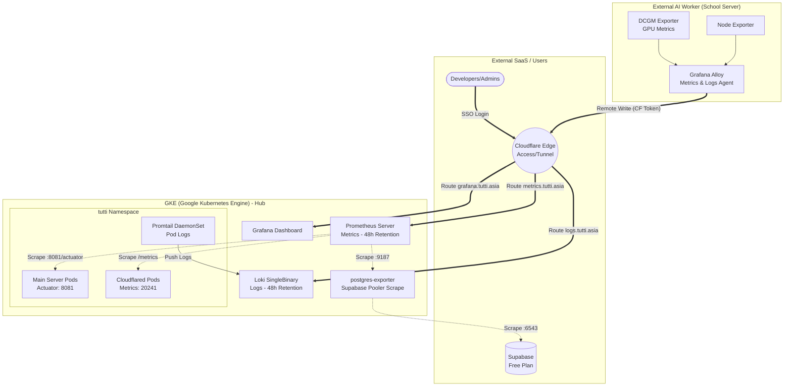

# Tutti 통합 모니터링 아키텍처 가이드 (Observability)

이 문서는 Tutti 프로젝트의 GKE(Google Kubernetes Engine), 온프레미스 AI 워커(학교 서버), 그리고 외부 SaaS(Supabase, Upstash) 자원을 아우르는 **통합 모니터링 및 로깅(Observability) 시스템**에 대한 설계 철학, 아키텍처, 그리고 보안 전략을 다룹니다.

---

## 1. 아키텍처 오버뷰 (Architecture Overview)

모든 모니터링 데이터의 중앙 허브는 GKE 내의 `monitoring` 네임스페이스입니다. 보안과 방화벽 정책의 일관성을 위해, **모든 외부 데이터는 GKE(허브)로 'Push'되거나 엣지 라우팅(CF Tunnel)을 거쳐 안전하게 수집됩니다.**

---

## 2. 주요 설계 결정 및 고려사항 (Design Decisions)

현재 인프라의 주요 한계점(GKE `e2-medium` 2노드 리소스 제약, 외부 인바운드 차단 환경, SaaS Free Plan 한도)을 극복하기 위해 다음과 같은 전략적 결정이 이루어졌습니다.

### 2.1 리소스 최적화 (GKE Node Constraints)
- **HPA 축소:** 모니터링 스택의 배포 공간 확보를 위해 `main-server`의 `maxReplicas`를 4에서 3으로 축소했습니다.
- **경량화 모드:** 
  - **Loki:** 컴포넌트를 분리하지 않고 `SingleBinary` 모드로 배포하여 초기 메모리 점유를 수백 MB 이하로 최소화했습니다.
  - **Prometheus:** GKE Managed 노드 컴포넌트(etcd, scheduler, proxy) 스크래핑을 비활성화하고, 데이터 보존 기간(`retention`)을 **48시간**으로 고정하여 디스크 및 메모리 사용량을 방어했습니다. (PVC 5Gi 할당)
  - **Node Exporter:** GKE 클러스터 내부에는 설치하지 않습니다. 기본적으로 제공되는 `SYSTEM_COMPONENTS` 메트릭을 활용합니다.

### 2.2 외부 장비 연결 (온프레미스 AI 워커)
- 학교 보안 정책상 **인바운드 포트 개방 불가**.
- 해결책: AI 워커에 단일 에이전트인 **Grafana Alloy**를 설치하여, 워커 내부의 `node-exporter`와 `dcgm-exporter(GPU)` 메트릭 및 시스템 로그를 긁어모아 GKE로 **밀어내는(Remote Write & Push)** 아웃바운드 구조를 채택했습니다.

### 2.3 외부 SaaS (Supabase, Upstash) 대응
- **Supabase (PostgreSQL):** GKE 내부에 `postgres-exporter`를 띄워 **Supabase Pooler 포트(6543)** 에 접근합니다. 쿼리 부하 최소화를 위해 스크랩 주기를 **60초**(기본 15초 대비 1/4 수준)로 늦췄으며, 커넥션 풀을 고갈시키지 않도록 설정했습니다.
- **Upstash (Redis):** 일일 1만 건 API 호출 한도의 제약 때문에 외부 익스포터를 쓰지 않습니다. 대신, Spring Boot 내부의 `micrometer-registry-prometheus`가 Redis Client(Lettuce)의 동작을 메트릭으로 추출하여 Prometheus가 가져가도록 간접 모니터링 방식을 선택했습니다.

---

## 3. 보안 아키텍처 (Security Implementation)

모니터링 데이터는 대단히 민감하므로(API Key, 내부 아키텍처 정보 포함) 엄격하게 격리되었습니다.

### 3.1 Spring Boot Actuator 포트 분리 (Port Isolation)
보안 상의 가장 큰 엣지 케이스는 외부 인터넷으로 `api.tutti.asia/actuator/prometheus`가 열리는 것이었습니다.
* **해결 방안:** Spring Boot의 `management.server.port`를 `8080`에서 **`8081`**로 완전히 분리했습니다. 
* **효과:** Cloudflare Tunnel(도메인 라우팅)은 애플리케이션 포트인 `8080`으로만 트래픽을 넘기므로, 외부망에서 Actuator에 접근하는 것은 **구조적으로 불가능**합니다. K8s 클러스터 내부의 Prometheus만이 `8081` 포트를 스크랩할 수 있습니다.

### 3.2 Cloudflare Zero Trust (Access Service Token)
AI 워커가 GKE의 Prometheus/Loki에 데이터를 보낼 때, Basic Auth를 구성하는 대신 **Cloudflare Zero Trust**를 적극 활용합니다.
1. `metrics.tutti.asia`, `logs.tutti.asia`, `grafana.tutti.asia` 서브도메인을 CF Tunnel에 연결.
2. 해당 도메인에 **Cloudflare Access (Zero Trust)** 정책 적용:
   - **Grafana UI:** 관리자 이메일 인증(SSO/OTP) 적용.
   - **Metrics & Logs API:** 'Service Auth' 전용 정책을 만들어 발급받은 `CF-Access-Client-Id`, `CF-Access-Client-Secret` 헤더가 없는 모든 HTTP 요청을 엣지 서버(Cloudflare) 단계에서 차단 처리.

---

## 4. 로그 포맷팅 (Log Formatting)

디버깅과 로그 탐색 속도를 업계 표준 수준으로 끌어올리기 위해 `logback-spring.xml`을 분리 적용했습니다.
* **로컬/개발 환경 (`local`, `dev`):** ConsoleAppender를 사용하여 시각적으로 가독성 높은 **컬러 구분 로그** 적용. Hibernate SQL 출력 제어.
* **운영 환경 (`prod`):** **한 줄 JSON 포맷**으로 출력 (`{"timestamp":"...", "level":"INFO", ...}`).
  * GKE의 `Promtail`이 이 JSON을 자동으로 파싱하여 Grafana Loki로 전송합니다.
  * Grafana 내에서 텍스트 그렙(grep)을 넘어 필드 기반 필터링(`{level="ERROR", logger="ArrangementService"}`)이 즉각적으로 가능해집니다.
