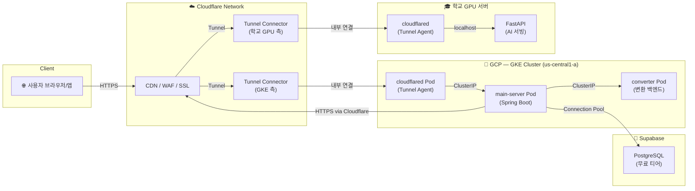

# Tutti — 배포 전략 및 환경 구성 가이드

> **MIDI 트랙 생성 AI 서비스**의 비용 제로화 클라우드 아키텍처  
> GKE Spot VM + Cloudflare Tunnel 하이브리드 구성

---

## 1. 아키텍처 개요

### 1.1 전체 트래픽 흐름



### 1.2 핵심 트래픽 시나리오

| 시나리오         | 흐름                                                                           |
| ---------------- | ------------------------------------------------------------------------------ |
| **API 요청**     | Client → Cloudflare CDN → Tunnel → GKE `cloudflared` → `main-server`           |
| **AI 추론 요청** | `main-server` → Cloudflare Tunnel(outbound) → 학교 GPU `cloudflared` → FastAPI |
| **AI 콜백 응답** | FastAPI → 학교 `cloudflared` → Cloudflare → GKE `cloudflared` → `main-server`  |
| **DB 접근**      | `main-server` → Supabase PostgreSQL (직접 연결, HikariCP 커넥션 풀)            |

---

## 2. 비용 제로화 전략

### 2.1 비용 비교표

| 컴포넌트                | 일반 구성 (월 예상 비용)     | 비용 제로화 구성                  | 절감률   |
| ----------------------- | ---------------------------- | --------------------------------- | -------- |
| **GKE 관리비**          | Regional ($74.40)            | **Zonal (무료)**                  | 100%     |
| **워커 노드**           | e2-medium On-demand ($24.46) | **e2-medium Spot ($7.34)**        | ~70%     |
| **로드밸런서**          | GCE LB ($18+)                | **Cloudflare Tunnel (무료)**      | 100%     |
| **고정 IP**             | Static IP ($7.30)            | **불필요 (Tunnel)**               | 100%     |
| **SSL 인증서**          | Managed Cert ($0)            | **Cloudflare SSL (무료)**         | -        |
| **DNS**                 | Cloud DNS ($0.20+)           | **Cloudflare DNS (무료)**         | 100%     |
| **컨테이너 레지스트리** | GCR (egress 과금)            | **Artifact Registry (무료 티어)** | ~100%    |
| **DB**                  | Cloud SQL ($25+)             | **Supabase (무료 티어)**          | 100%     |
| **총합**                | ~$150+/월                    | **~$7.34/월 (Spot VM만)**         | **95%+** |

> **💡 GCP 3개월 무료 크레딧**으로 Spot VM 비용도 충당 → 실질 비용 $0

### 2.2 Spot VM 전략

```
┌─────────────────────────────────────────────────────┐
│  왜 Spot VM인가?                                      │
│                                                      │
│  • 60-91% 비용 절감 (e2-medium 기준 ~70%)              │
│  • GKE의 자동 복구: Spot 노드 선점 시 자동으로 새 노드 생성   │
│  • 전시 프로젝트 특성상 99.9% SLA 불필요                  │
│  • Pod Disruption Budget으로 graceful shutdown 보장    │
│                                                      │
│  주의사항:                                             │
│  • 노드가 24시간 내에 선점될 수 있음                       │
│  • terminationGracePeriodSeconds 설정 필수            │
│  • 단일 레플리카 운영 시 짧은 다운타임 발생 가능            │
└─────────────────────────────────────────────────────┘
```

---

## 3. 환경별 구성

### 3.1 환경 비교

| 항목     | 로컬 (local)                   | 운영 (prod)                      |
| -------- | ------------------------------ | -------------------------------- |
| DB       | Docker PostgreSQL              | Supabase                         |
| AI 서버  | localhost:8000                 | Cloudflare Tunnel → 학교 GPU     |
| 네트워크 | Docker network                 | Cloudflare Tunnel                |
| 프로필   | `SPRING_PROFILES_ACTIVE=local` | `SPRING_PROFILES_ACTIVE=prod`    |
| 시크릿   | `.env` 파일                    | K8s Secret (GitHub Actions 주입) |

---

## 4. 초기 세팅 체크리스트

### Phase 1: GCP 프로젝트 준비

- [ ] GCP 프로젝트 생성 및 3개월 크레딧 연결
- [ ] 필요한 API 활성화
  ```bash
  gcloud services enable \
    container.googleapis.com \
    artifactregistry.googleapis.com \
    iam.googleapis.com \
    cloudresourcemanager.googleapis.com
  ```
- [ ] Terraform 서비스 계정 생성

  ```bash
  gcloud iam service-accounts create terraform \
    --display-name="Terraform SA"

  # 필요 역할 부여
  for role in roles/container.admin roles/artifactregistry.admin \
    roles/iam.serviceAccountUser roles/compute.admin; do
    gcloud projects add-iam-policy-binding $PROJECT_ID \
      --member="serviceAccount:terraform@$PROJECT_ID.iam.gserviceaccount.com" \
      --role="$role"
  done
  ```

### Phase 2: Terraform 인프라 프로비저닝

- [ ] Terraform 변수 파일 작성
  ```bash
  cp infra/terraform.tfvars.example infra/terraform.tfvars
  # project_id 등 실제 값 입력
  ```
- [ ] 인프라 생성
  ```bash
  cd infra
  terraform init
  terraform plan          # 리소스 계획 확인
  terraform apply         # GKE 클러스터 + Spot 노드풀 + Artifact Registry 생성
  ```
- [ ] kubeconfig 설정
  ```bash
  gcloud container clusters get-credentials tutti-cluster \
    --zone us-central1-a --project $PROJECT_ID
  ```

### Phase 3: Cloudflare 설정

- [ ] Cloudflare 계정 생성 및 도메인 등록
- [ ] Cloudflare Tunnel 생성 (GKE용)
  ```bash
  cloudflared tunnel create tutti-gke
  # 출력되는 Tunnel ID와 credentials 파일 저장
  ```
- [ ] Cloudflare Tunnel 생성 (학교 GPU 서버용)
  ```bash
  cloudflared tunnel create tutti-gpu
  ```
- [ ] Cloudflare Dashboard에서 DNS 라우팅 설정
  - `REDACTED` → `tutti-gke` tunnel
  - `REDACTED` → `tutti-gpu` tunnel (내부용)

### Phase 4: GitHub 설정

- [ ] GitHub Repository Secrets 등록

  | Secret Name                      | 설명                                                                                     |
  | -------------------------------- | ---------------------------------------------------------------------------------------- |
  | `GCP_WORKLOAD_IDENTITY_PROVIDER` | `projects/PROJECT_NUMBER/locations/global/workloadIdentityPools/POOL/providers/PROVIDER` |
  | `GCP_SERVICE_ACCOUNT`            | `github-actions@PROJECT_ID.iam.gserviceaccount.com`                                      |
  | `SUPABASE_KEY`                   | Supabase anon/service key                                                                |
  | `SUPABASE_URL`                   | Supabase project URL                                                                     |
  | `SUPABASE_DB_URL`                | `jdbc:postgresql://...`                                                                  |
  | `SUPABASE_DB_USERNAME`           | DB 사용자명                                                                              |
  | `SUPABASE_DB_PASSWORD`           | DB 비밀번호                                                                              |
  | `JWT_SECRET`                     | 256-bit JWT 시크릿                                                                       |
  | `CLOUDFLARE_TUNNEL_TOKEN`        | Cloudflare Tunnel 토큰                                                                   |
  | `AI_CALLBACK_SECRET`             | AI 콜백 인증 시크릿                                                                      |

- [ ] GitHub Repository Variables 등록

  | Variable Name      | Value           |
  | ------------------ | --------------- |
  | `GCP_PROJECT_ID`   | GCP 프로젝트 ID |
  | `GCP_REGION`       | `us-central1`   |
  | `GKE_CLUSTER_NAME` | `tutti-cluster` |
  | `GKE_ZONE`         | `us-central1-a` |

### Phase 5: Workload Identity Federation 설정

GitHub Actions가 GCP에 키 없이 인증하기 위한 OIDC 연동:

```bash
# 1. Workload Identity Pool 생성
gcloud iam workload-identity-pools create "github-pool" \
  --location="global" \
  --display-name="GitHub Actions Pool"

# 2. OIDC Provider 생성
gcloud iam workload-identity-pools providers create-oidc "github-provider" \
  --location="global" \
  --workload-identity-pool="github-pool" \
  --display-name="GitHub Provider" \
  --attribute-mapping="google.subject=assertion.sub,attribute.repository=assertion.repository" \
  --issuer-uri="https://token.actions.githubusercontent.com"

# 3. GitHub Actions 서비스 계정 생성
gcloud iam service-accounts create github-actions \
  --display-name="GitHub Actions SA"

# 4. 필요 역할 부여
for role in roles/container.developer roles/artifactregistry.writer; do
  gcloud projects add-iam-policy-binding $PROJECT_ID \
    --member="serviceAccount:github-actions@$PROJECT_ID.iam.gserviceaccount.com" \
    --role="$role"
done

# 5. Workload Identity 바인딩
gcloud iam service-accounts add-iam-policy-binding \
  github-actions@$PROJECT_ID.iam.gserviceaccount.com \
  --role="roles/iam.workloadIdentityUser" \
  --member="principalSet://iam.googleapis.com/projects/PROJECT_NUMBER/locations/global/workloadIdentityPools/github-pool/attribute.repository/OWNER/REPO"
```

### Phase 6: 첫 배포

- [ ] K8s 네임스페이스 & 시크릿 생성
  ```bash
  kubectl apply -f k8s/base/namespace.yaml
  # secrets.yaml을 secrets-template.yaml에서 복사 후 실제 값 입력
  kubectl apply -f k8s/secrets/secrets.yaml
  ```
- [ ] Kustomize로 전체 배포
  ```bash
  kubectl apply -k k8s/base/
  ```
- [ ] 배포 상태 확인
  ```bash
  kubectl get pods -n tutti
  kubectl logs -f deployment/main-server -n tutti
  ```
- [ ] Cloudflare Tunnel 연결 확인
  ```bash
  curl https://REDACTED/actuator/health
  ```

### Phase 7: 학교 GPU 서버 설정

- [ ] `cloudflared` 설치
  ```bash
  # Linux (학교 서버)
  wget https://github.com/cloudflare/cloudflared/releases/latest/download/cloudflared-linux-amd64
  chmod +x cloudflared-linux-amd64
  sudo mv cloudflared-linux-amd64 /usr/local/bin/cloudflared
  ```
- [ ] Tunnel 실행 (systemd 서비스로 등록 권장)
  ```bash
  cloudflared tunnel run --token $TUNNEL_TOKEN
  ```
- [ ] FastAPI 서버 실행 확인
  ```bash
  curl http://localhost:8000/health
  ```

---

## 5. 포트폴리오 하이라이트

이 아키텍처에서 어필할 수 있는 기술 포인트:

| 카테고리                    | 기술 요소                                                           |
| --------------------------- | ------------------------------------------------------------------- |
| **IaC**                     | Terraform으로 GKE + Spot VM + AR 전체 인프라 코드화                 |
| **비용 최적화**             | Spot VM (70% 절감), Cloudflare Tunnel (LB 제거), Supabase (DB 무료) |
| **CI/CD**                   | GitHub Actions + Workload Identity Federation (키리스 인증)         |
| **하이브리드 클라우드**     | GCP + On-premise GPU 서버를 Cloudflare Tunnel로 통합                |
| **보안**                    | OIDC 기반 인증, K8s Secret, non-root 컨테이너, Cloudflare WAF       |
| **컨테이너 오케스트레이션** | Kustomize, HPA, Pod Disruption Budget, Graceful Shutdown            |
